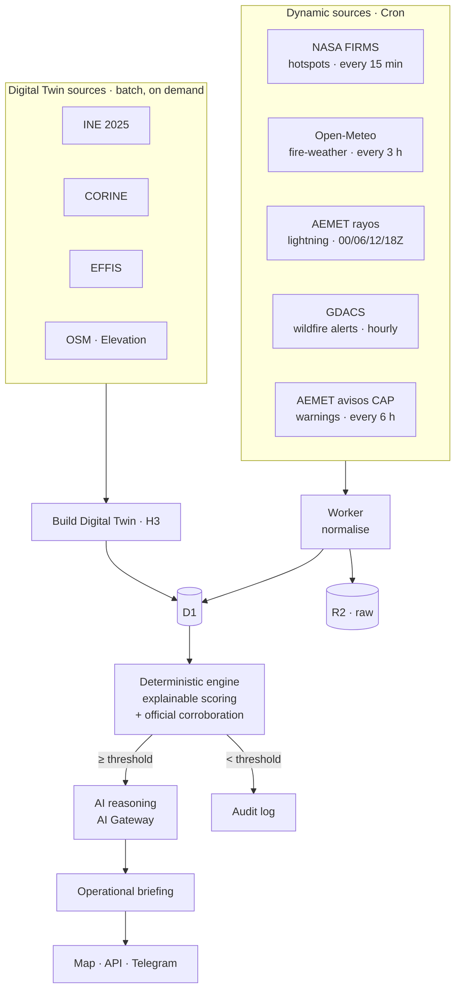

# Architecture notes

Companion to the [master document](../specs/Geospatial_Intelligence_Platform_Master_Document.md).
This file records **implementation decisions** — why the code looks the way it does.

## Information & update flows

Dynamic feeds refresh on Cron (FIRMS 15 min, weather every 3 h, lightning 4×/day, GDACS
hourly, AEMET avisos every 6 h); the Digital Twin is a batch rebuild run on demand. GDACS
and AEMET avisos are official alerts stored in `hazard_alert` and used by the engine to
corroborate its own decisions. The deterministic engine is the only component that creates
events; the LLM runs only above threshold. The same diagram is embedded on the landing
page as a pre-rendered inline SVG (zero JS, so Lighthouse stays at 100).

## 1. Everything on Cloudflare

A single Worker hosts both the scheduled ingestion (`scheduled()`) and the read API
(`fetch()`). Storage is D1 (relational), R2 (raw payloads), KV (config). This keeps the
MVP to one deployable unit with scale-to-zero cost.

## 2. No PostGIS — H3 is the spatial key

D1 is SQLite with no spatial extension. Instead of geometry SQL:

- On ingest, every detection is resolved to an **H3 cell** (`res 7`, ~5 km²) and stored
  in `observation.h3_cell`. The Digital Twin and fire weather use the same key.
- Joining detection ↔ context ↔ weather is therefore an **indexed equality lookup**, not
  a spatial query.
- Polygon/distance math (footprints, buffers) runs **in the Worker** with `h3-js`
  (add `@turf/turf` when Phase 3 needs distance-to-asset), on demand around active events.
- Source rasters/vectors stay in native format in R2; only per-cell summaries reach D1.

## 3. Direct writes now, Queue later

Phase 1 ingestion writes straight to D1/R2. The Queue in the blueprint is deferred to
**Phase 3**, when the consumer does deterministic scoring + an LLM call and decoupling
(retries, backpressure, DLQ) earns its keep. Adding it now would be complexity without
payoff.

## 4. Precision honesty

Per the spec's *Spatial Resolution & Uncertainty Principle*, each `observation` stores
`nominal_resolution_m`, `geolocation_uncertainty_m`, `confidence` and an approximate
`footprint_geojson`. The footprint is a square sized to the sensor pixel (375 m for
VIIRS) — deliberately not a point. Downstream outputs must never imply finer precision.

## 5. Configuration lives in `src/config.ts`

Region bbox, H3 resolution and feed constants are centralised. Re-pointing the platform
at another region is a one-file edit (plus rebuilding the Digital Twin).

## 6. Ingestion feeds (Phase 1)

| Feed | Source | Cadence | Auth | Notes |
|------|--------|---------|------|-------|
| Hotspots | NASA FIRMS — VIIRS SNPP + NOAA-20 + NOAA-21 + MODIS (Area CSV API) | 15 min | free map key | all constellations merged; deterministic ids dedup re-fetches |
| Fire weather | Open-Meteo current + 3-day hourly forecast | every 3 h | none | 213-point surface-uniform grid clipped to Aragón (~15 km), one bulk call; Triple-30 + `forecast_json` per point |
| Lightning | AEMET rayos (McIDAS GIF, decoded) | 00/06/12/18Z | AEMET key | cloud-to-ground strikes → `lightning_watch` windows (~5–15 km) |
| Wildfire alerts | **GDACS** — EVENTS4APP WF GeoJSON (JRC/UN) | hourly | none | Spain + Aragón; alert level Green/Orange/Red → `hazard_alert`; corroborates engine confidence |
| Weather warnings | **AEMET avisos** — CAP 1.2, `ultimoelaborado/area/62` (Aragón) | every 6 h | AEMET key | tar of CAP XML, untarred + parsed in-Worker; heat/wind/storm → `hazard_alert`; raises engine fire-weather floor |

Both alert feeds land in the shared `hazard_alert` table (migration 0009): discrete,
expiring warnings from other agencies, kept alongside — never conflated with — the
platform's own detections. Pruned once past `expires`. See §"Hazard alerts" below.

## 7. Digital Twin build (Phase 2)

The Digital Twin is a **build-time batch job** (`scripts/build-digital-twin.mjs`), not a
runtime path. It enumerates the H3 res-7 cells covering Aragón and enriches each, then
emits idempotent `INSERT OR REPLACE` SQL applied to D1. No new dependencies — `h3-js`
plus native `fetch`; distance/bearing are inline haversine.

| Field | Source | Status |
|-------|--------|--------|
| cell set | Nominatim boundary of Aragón → `h3.polygonToCells` (res 7, ~9.4k cells) | real |
| `slope_deg`, `aspect_deg` | Open-Elevation → steepest-descent over the H3 neighbourhood | real |
| `population`, `population_density` | **INE Censo Anual 2025** by census section (ref 1-Jan-2025), areally interpolated to H3 | real, authoritative |
| `dist_asset_m` | nearest OSM asset (fire station, substation, settlement) via Overpass | real, best-effort |
| `land_cover`, `fuel_type` | **CORINE Land Cover 2018** (Copernicus/EEA), per-cell class via ArcGIS Identify → fuel class | real, authoritative |
| `hist_fire_flag` | **EFFIS** burnt-area perimeters (`modis.ba.poly`) intersecting the cell | real, authoritative |

### Population: INE Censo Anual 2025 (authoritative)

Population comes from the **original INE source**, not the Eurostat republication (which is
the fixed 2021 census). Two INE endpoints, joined by the 10-digit `CUSEC` section code:

- **Geometry** — INE OGC API Features (`Secciones_2025` collection, filter
  `CCA='02' AND TIPO='SECCIONADO'`) → 1,463 Aragón census sections as GeoJSON. No shapefile parsing.
- **Population** — INE Censo Anual jaxiT3 CSV tables, one per Aragón province (Huesca 69193,
  Zaragoza 69289, Teruel 69345), filtered to `Total / Todas las edades / 2025`. Total ≈ 1.36 M
  (matches the official Aragón figure).

**Areal interpolation to H3**: each section polygon is discretised into equal-area H3 res-9
subcells (~0.1 km²); its population is split evenly across them and re-aggregated to the res-7
parent cells. This handles both large rural sections (spread across many cells) and dense urban
sections (many sections per cell). `population_density` = population / cell area (people/km²).
Sections with <50 residents are suppressed by INE (statistical secrecy) and count as 0.

**Population by age** — the same table carries five-year age bands (both sexes). We store the
full breakdown, each interpolated to H3 the same way: `pop_child` (0-14), `pop_adult` (15-64)
and `pop_elderly` (65+), with `pop_child + pop_adult + pop_elderly = population`. For Aragón:
12.8% children, 64.6% working-age, 22.6% elderly — an aged region where the elderly share is
the key vulnerability signal for Phase 3 scoring/briefings.

Design choices:

- **Res 7 is mandatory**, not a tuning knob: observations are indexed at res 7
  (`src/config.ts`), so the twin must match for the cell-key join to work.
- **Terrain + population are authoritative; OSM (dist_asset_m) is best-effort** — if
  Overpass fails, cells still get terrain and population; only `dist_asset_m` stays NULL.
  Phase 3 scoring must treat NULLs as neutral.
- **Elevation via Open-Elevation** (bulk POST, no hourly cap), checkpointed to
  `tmp/elevations.json` so re-runs are near-free. (Open-Meteo's elevation API was dropped:
  its free tier hourly limit can't cover ~9.4k points in one run.)
- Slope is a **cell-scale** value (gradient over the ~1.4 km res-7 neighbourhood), not
  slope at a point — consistent with the platform's precision-honesty principle.

### Land cover, fuel & fire history (Phase 2.1)

- **`land_cover` / `fuel_type`** — CORINE Land Cover 2018 sampled per cell via the EEA
  ArcGIS **Identify** point query (`CLC2018_WM` MapServer). The CLC `CODE_18` class is
  mapped to a wildfire fuel class (`none`/`low`/`medium`/`high`/`very_high`). ~9.4k point
  queries at concurrency 6, checkpointed to `tmp/landcover.json` (resumable). No
  getSamples/ImageServer is exposed, so per-cell Identify is the batch mechanism.
- **`hist_fire_flag`** — EFFIS burnt-area perimeters (`ms:modis.ba.poly`, WFS GeoJSON,
  ≥30 ha, 2000→present) intersecting Aragón; each perimeter is discretised to res-7 cells
  which are flagged. Best-effort: if EFFIS is unavailable the flag defaults to 0.

## Deterministic decision engine (Phase 3)

The **authoritative** source of events (`src/engine/`). It runs after each FIRMS
pass over the recent detection window (24 h):

1. **Cluster** detections by exact H3 cell (k-ring merge is a documented refinement).
2. **Enrich** each cluster: Digital Twin cell (fuel/slope/population/exposure/municipio),
   the **nearest fire-weather point** (213-grid → FWI/Triple-30), any active
   **lightning watch** on the cell, and **official corroboration** resolved once per pass
   — a live **GDACS** wildfire alert over Aragón and the highest active **AEMET** fire-weather
   warning level (`hazard_alert`).
3. **Score** — `score.ts` is a pure, unit-tested function. Two outputs:
   - **confidence** (is it a real active fire): persistence + source confidence + a
     corroboration boost from a lightning watch **or** a GDACS wildfire alert. **Gates event
     creation.**
   - **score** (operational priority): a weighted sum of five NAMED, normalised
     contributions — `persistence`, `source_confidence`, `fire_weather`,
     `fuel_terrain`, `exposure`. An active AEMET fire-weather warning raises the
     `fire_weather` floor to its level (amarillo/naranja/rojo). Every raw/normalised/weighted
     value — plus the corroboration flags — is echoed in `score_breakdown_json`, so each
     decision is fully auditable. The five weights are unchanged: official signals lift
     existing contributions, they don't add a new one.
4. **Decide**: if `confidence ≥ threshold` → create/update an active `event` (one per
   cell); else write an audit row (`stage='score'`, `below_threshold`). The LLM never
   runs here — that's Phase 4, only for events above threshold.

**Weights + threshold are tunable live** from KV `CONFIG` key `engine_config` (JSON,
merged over the defaults in `score.ts`) — no redeploy. `GET /events` lists active
events; `GET /dev/engine/config` shows the effective config; `/dev/engine/run` and
`/dev/observe/test` drive it when there are no live hotspots.

Design choices: scoring is pure and separate from I/O (testable); normalisation
constants are deliberately simple and documented in `score.ts` (tune via KV); one
active event per cell keeps the model simple and idempotent.

## Open items

- **FWI System** (`src/lib/fwi.ts`) computes the Canadian fire-weather indices daily from
  the grid's noon forecast — FFMC/DMC/DC/ISI/BUI/FWI (`fire_weather.ffmc…fwi`, migration
  0007, cron `0 12 * * *`). This replaces the RH fuel-moisture proxy and gives a drought
  signal (DC). The moisture codes accumulate day to day; a one-off spin-up over 90 days of
  historical daily weather (Open-Meteo archive, `/dev/compute/fwi-spinup`) has been run so
  DC is already realistic (~530 for July Aragón, vs ~15 from cold-start). The daily cron
  continues from there. (Old `fuel_moisture_proxy` column kept but superseded by FFMC.)
- Fire weather is a **surface-uniform ~15 km grid clipped to Aragón** (213 points,
  `scripts/build-weather-grid.mjs` → `src/weather-points.json`), refreshed every 3 h with a
  3-day hourly forecast per point (`fire_weather.forecast_json`). Background layer only:
  Phase 3 fetches **exact event-time weather on demand** for a detection's cell (option B),
  so the free Open-Meteo budget (~51k/month for the grid) leaves ample room for events.
  A denser grid (>500 coords) would need chunked bulk calls (GET URL caps at ~8 KB / 414).
- Fuel class from CLC is a coarse mapping; a fire-behaviour fuel model (e.g. Scott &
  Burgan / Prometheus) could refine it later.
- **AEMET bias correction** — the weather grid can be corrected with AEMET station
  observations via a background + residual approach (correct Open-Meteo's local bias,
  don't interpolate the sparse stations). Design + roadmap:
  [`docs/meteo-bias-correction.md`](meteo-bias-correction.md). Blocked on ingesting
  AEMET conventional observations (today the platform ingests AEMET lightning and CAP
  warnings, but not the station observation network).
- **Hazard-alert zone precision** — AEMET warnings are matched to Aragón region-wide, not
  per H3 cell: `officialFireWeatherLevel` is the max active fire-relevant level over the
  region. Per-zone point-in-polygon (the CAP `<polygon>` per Meteoalerta zone → the cells it
  covers) is a documented refinement, mirroring the k-ring clustering note. GDACS points are
  coarse event centroids, so a wildfire alert corroborates region-wide, not per cell.
- **Active-fire sources beyond FIRMS** — evaluated, none added (deliberate). EFFIS, GWIS
  and every Spanish live-fire map are **NASA FIRMS-derived** (same MODIS/VIIRS, republished
  2–3 h later), so redundant with the four constellations already ingested. Sentinel-3 SLSTR
  FRP is another polar sensor (marginal) behind EUMETSAT granule access. The only genuinely
  complementary option — geostationary **Meteosat SEVIRI FRP** (LSA SAF, 15-min) — needs a
  EUMETSAT account and HDF/BUFR granule parsing, too heavy for an edge cron. Revisit only if
  sub-hourly geostationary detection becomes a hard requirement.
- **EFFIS Fire Danger Forecast (FWI)** — evaluated but **not** wired as a Worker cron. EFFIS
  exposes fire danger only as WMS rasters (`ies-ows.jrc.ec.europa.eu`, layer `ecmwf.fwi.*`);
  `GetFeatureInfo` point queries did not return values in testing, and there is no clean
  per-point JSON/REST API. It is also largely redundant with the platform's own per-cell FWI
  (`lib/fwi.ts`). If an official European reference is wanted, the daily forecast raster
  belongs in the **offline Digital-Twin build** (`scripts/build-digital-twin.mjs`, where EFFIS
  burnt-area *history* already lives), not on the edge — added there the same way, on demand.
